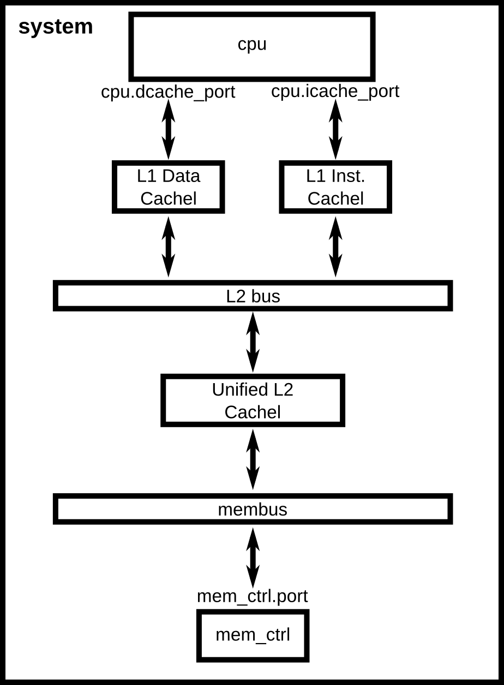

# 实验1 学习使用gem5模拟器

## 1 编译gem5模拟器

运行下列指令，配置环境后对gem5模拟器进行编译：

```shell
sudo apt install build-essential git m4 scons zlib1g zlib1g-dev libprotobuf-dev protobuf-compiler libprotoc-dev libgoogle-perftools-dev python-dev python
sudo apt install libhdf5-dev
sudo apt install libpng-dev
scons build/X86/gem5.opt -j7 CPU_MODELS=AtomicSimpleCPU,TimingSimpleCPU,O3CPU,MinorCPU 
```

编译后terminal显示结果如下，编译后得到的可执行文件可以在`build`文件夹下找到：


## 2 运行`simple.py`


`simple.py`描述了如下的体系结构：


由于所有的class都是系统预设的，所以可以直接将这些预设class实例化。需要注意的是，在port之间的连接时，需要遵循request port到response port的连接准则。具体来说，request port作为`=`的左值，response port作为`=`的右值，如此进行port之间的连接。另外一点需要注意的是，在设置path时（包括binary的path和调用包的path），需要根据当前python程序的实际位置进行相对位置的设置。


## 3 运行`two_level.py`


`two_level.py`描述了如下的体系结构：



由于L1的Data Cache、Instruction Cache和L2 Cache都是自定义的，这些class需要在`cache.py`中进行定义。它们之间的继承关系如下所示：


在对这些class进行妥善定义后，对各个部件进行实例化。和`simple.py`类似，按照request port到response port的连接方式即可在`two_level.py`中对该体系结构进行描述。需要注意的是，任意两个部件之间需要有bus的参与，它们往往在系统中以预设的class存在。