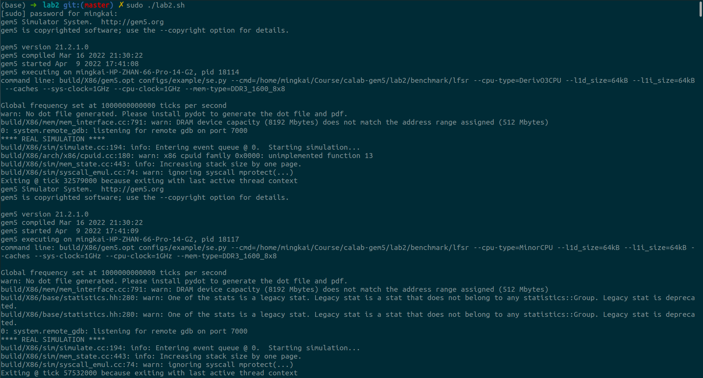
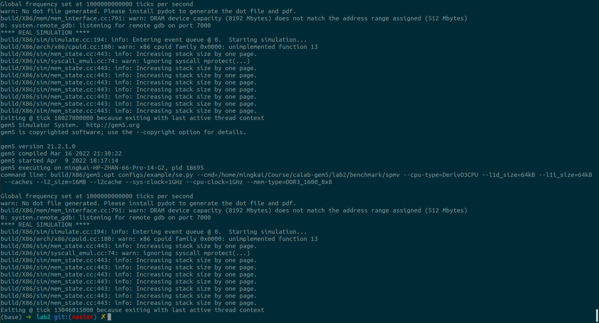

# 实验2 使用gem5对benchmark做性能分析

## 1 参数配置

首先，在benchmark所在文件夹下执行如下指令以获得编译后的可执行文件。

```shell
> make gen_arr
> make
```

除了Issue Width外，其他的参数均在性能分析的指令中作为参数进行传入和设置。对`se.py`进行传参的方法可以通过在`gem5-stable`下执行下面的指令进行查询：

```shell
> build/X86/gem5.opt configs/example/se.py --help
```

Issue Width的修改在`configs/example/se.py`中。具体来说，其在不显式声明的情况下的Issue Width为8，当需要设定Issue Width为2时，需要对`se.py`的`cpu`（第197行）进行如下的设置：

```python
for cpu in system.cpu:
    cpu.clk_domain = system.cpu_clk_domain
    cpu.issueWidth = 2; # set issue width as 2
```

我们将添加了Issue Width声明（为2）后的程序命名为`se_width2.py`，仍然放在`configs/example/`下。在若干次的测试中，相同的配置如下所示：

| 配置      | 值            |
| --------- | ------------- |
| memory    | DDR3_1600_8x8 |
| L1 icache | 64KB          |
| L1 dcache | 64KB          |

对于各个需要测试的配置，我们按照`config1`到`config7`进行命名，其执行的指令如下（在`gem5-stable`文件夹下执行）：

>  注意：`cmd=`后的`test_file`需要改成相应benchmark的地址，如对于`spmv`的`comfigs2`有
>
>  ```shell
>  > build/X86/gem5.opt configs/example/se.py --cmd=/home/mingkai/Course/calab-gem5/lab2/benchmark/spmv --cpu-type=MinorCPU --l1d_size=64kB --l1i_size=64kB --caches --sys-clock=1GHz --cpu-clock=1GHz --mem-type=DDR3_1600_8x8
>  ```

| 编号    | CPU_type | Issue width | CPU_clock | L2 cache | 指令                                                         | 注释                                |
| ------- | -------- | ----------- | --------- | -------- | ------------------------------------------------------------ | ----------------------------------- |
| config1 | O3CPU    | 8           | 1GHz      | No       | `build/X86/gem5.opt configs/example/se.py --cmd=test_file --cpu-type=DerivO3CPU --l1d_size=64kB --l1i_size=64kB --caches --sys-clock=1GHz --cpu-clock=1GHz --mem-type=DDR3_1600_8x8` |                                     |
| config2 | MinorCPU | 8           | 1GHz      | No       | `build/X86/gem5.opt configs/example/se.py --cmd=test_file --cpu-type=MinorCPU --l1d_size=64kB --l1i_size=64kB --caches --sys-clock=1GHz --cpu-clock=1GHz --mem-type=DDR3_1600_8x8` | `--cpu-type=MinorCPU`               |
| config3 | O3CPU    | 2           | 1GHz      | No       | `build/X86/gem5.opt configs/example/se2.py --cmd=test_file --cpu-type=DerivO3CPU --l1d_size=64kB --l1i_size=64kB --caches --sys-clock=1GHz --cpu-clock=1GHz --mem-type=DDR3_1600_8x8` | `configs/example/se2.py`            |
| config4 | O3CPU    | 8           | 4GHz      | No       | `build/X86/gem5.opt configs/example/se.py --cmd=test_file --cpu-type=DerivO3CPU --l1d_size=64kB --l1i_size=64kB --caches --sys-clock=4GHz --cpu-clock=4GHz --mem-type=DDR3_1600_8x8` | `--sys-clock=4GHz --cpu-clock=4GHz` |
| config5 | O3CPU    | 8           | 1GHz      | 256kB    | `build/X86/gem5.opt configs/example/se.py --cmd=test_file --cpu-type=DerivO3CPU --l1d_size=64kB --l1i_size=64kB --caches --l2_size=256kB --l2cache --sys-clock=1GHz --cpu-clock=1GHz --mem-type=DDR3_1600_8x8` | `--l2_size=256kB --l2cache`         |
| config6 | O3CPU    | 8           | 1GHz      | 2MB      | `build/X86/gem5.opt configs/example/se.py --cmd=test_file --cpu-type=DerivO3CPU --l1d_size=64kB --l1i_size=64kB --caches --l2_size=2MB --l2cache --sys-clock=1GHz --cpu-clock=1GHz --mem-type=DDR3_1600_8x8` | `--l2_size=2MB --l2cache`           |
| config7 | O3CPU    | 8           | 1GHz      | 16MB     | `build/X86/gem5.opt configs/example/se.py --cmd=test_file --cpu-type=DerivO3CPU --l1d_size=64kB --l1i_size=64kB --caches --l2_size=16MB --l2cache --sys-clock=1GHz --cpu-clock=1GHz --mem-type=DDR3_1600_8x8` | `--l2_size=16MB --l2cache`          |

可编写`.sh`文件如下：

```sh
GEM5=/home/mingkai/Course/calab-gem5/gem5-stable
SRC_DIR=/home/mingkai/Course/calab-gem5/lab2/benchmark
RESULT_DIR=/home/mingkai/Course/calab-gem5/lab2/result
TARGET8=configs/example/se.py
TARGET2=configs/example/se_width2.py

# Clean result dir
rm -rf ${RESULT_DIR}/*
for FILE in lfsr merge mm sieve spmv; do
    mkdir -p ${RESULT_DIR}/${FILE}
done

cd $GEM5

for FILE in lfsr merge mm sieve spmv; do
    # config1: O3CPU issue_witdth:8 1GHz L2:No
    # DDR3_1600_8x8 l1i:64kb l1d:64kb
    build/X86/gem5.opt ${TARGET8} --cmd=${SRC_DIR}/${FILE} --cpu-type=DerivO3CPU \
        --l1d_size=64kB --l1i_size=64kB --caches\
        --sys-clock=1GHz --cpu-clock=1GHz --mem-type=DDR3_1600_8x8
    cp -r m5out/ ${RESULT_DIR}/${FILE}/config1/

    # config2: MinorCPU issue_witdth:8 1GHz L2:No
    # DDR3_1600_8x8 l1i:64kb l1d:64kb
    build/X86/gem5.opt ${TARGET8} --cmd=${SRC_DIR}/${FILE} --cpu-type=MinorCPU \
        --l1d_size=64kB --l1i_size=64kB --caches\
        --sys-clock=1GHz --cpu-clock=1GHz --mem-type=DDR3_1600_8x8
    cp -r m5out/ ${RESULT_DIR}/${FILE}/config2/

    # config3: O3CPU issue_witdth:2 1GHz L2:No
    # DDR3_1600_8x8 l1i:64kb l1d:64kb
    build/X86/gem5.opt ${TARGET2} --cmd=${SRC_DIR}/${FILE} --cpu-type=DerivO3CPU \
        --l1d_size=64kB --l1i_size=64kB --caches\
        --sys-clock=1GHz --cpu-clock=1GHz --mem-type=DDR3_1600_8x8
    cp -r m5out/ ${RESULT_DIR}/${FILE}/config3/

    # config4: O3CPU issue_witdth:8 4GHz L2:No
    # DDR3_1600_8x8 l1i:64kb l1d:64kb
    build/X86/gem5.opt ${TARGET8} --cmd=${SRC_DIR}/${FILE} --cpu-type=DerivO3CPU \
        --l1d_size=64kB --l1i_size=64kB --caches\
        --sys-clock=4GHz --cpu-clock=4GHz --mem-type=DDR3_1600_8x8
    cp -r m5out/ ${RESULT_DIR}/${FILE}/config4/

    # config5: O3CPU issue_witdth:8 1GHz L2:256kB
    # DDR3_1600_8x8 l1i:64kb l1d:64kb
    build/X86/gem5.opt ${TARGET8} --cmd=${SRC_DIR}/${FILE} --cpu-type=DerivO3CPU \
        --l1d_size=64kB --l1i_size=64kB --caches --l2_size=256kB --l2cache \
        --sys-clock=1GHz --cpu-clock=1GHz --mem-type=DDR3_1600_8x8
    cp -r m5out/ ${RESULT_DIR}/${FILE}/config5/

    # config6: O3CPU issue_witdth:8 1GHz L2:2MB
    # DDR3_1600_8x8 l1i:64kb l1d:64kb
    build/X86/gem5.opt ${TARGET8} --cmd=${SRC_DIR}/${FILE} --cpu-type=DerivO3CPU \
        --l1d_size=64kB --l1i_size=64kB --caches --l2_size=2MB --l2cache \
        --sys-clock=1GHz --cpu-clock=1GHz --mem-type=DDR3_1600_8x8
    cp -r m5out/ ${RESULT_DIR}/${FILE}/config6/

    # config7: O3CPU issue_witdth:8 1GHz L2:16MB
    # DDR3_1600_8x8 l1i:64kb l1d:64kb
    build/X86/gem5.opt ${TARGET8} --cmd=${SRC_DIR}/${FILE} --cpu-type=DerivO3CPU \
        --l1d_size=64kB --l1i_size=64kB --caches --l2_size=16MB --l2cache \
        --sys-clock=1GHz --cpu-clock=1GHz --mem-type=DDR3_1600_8x8
    cp -r m5out/ ${RESULT_DIR}/${FILE}/config7/
done
```

注意，在`mkdir`中加入`-p`是由于第一次创建时父文件夹并不存在，如不加入该参数会产生报错。`rm`和`cp`中的`-r`参数均是为了能够递归地将文件夹内的所有文件和文件夹都执行该操作。该`.sh`文件的执行结果如下（仅开始和结束时的截图）：





## 2 问题回答

### 1

**Question:**

应该使用什么指标来比较不同系统配置之间的性能？为什么？

**Answer:**

**如果存在多个指标不同，只有execution time才是唯一的可靠的比较指标**。对于不同配置在多个benchmark下的结果，其execution time对于不同benchmark的相对大小关系可能并不是不变的，此时，可以取benchmark的**几何平均**来进行总体上的大致比较。

如果对于同一个benchmark，且只有单项配置不同，还有下面的一些比较指标：

| 不同配置    | 比较指标（除execution time外）           | 说明                                                         |
| ----------- | ---------------------------------------- | ------------------------------------------------------------ |
| cpu_type    | CPI, branch prediction miss rate         | 不同的cpu_type可能会采用不同的流水线技术、结构设计和branch prediction策略，在clock cycle不变的情况下也可以通过CPI进行比较 |
| issue width | CPI                                      | 发射的宽度变大可能会减小CPI，但也要考虑到cache冲突带来的其他影响 |
| cpu_clock   | /                                        | 即使CPI变大，由于clock cycle变小，不能够说明性能变差         |
| L2 cache    | cache miss rate, cache miss penalty, CPI | L2 cache的增加一般会减小L1 cache miss penalty和减小cache miss rate（但是也可能会增加L2 miss下的miss penalty） |

### 2

**Question:**

是否有任何基准测试受益于删除L2缓存？请说明理由。

**Answer:**

我们此时需要比较在同一benchmark下的config1和config6的执行时间的差异。如果config1所用的时间更少的话，则该基准测试受益于删除L2缓存。在每次生成的`m5out/stats.txt`中找到`simTicks`一项，如下表所示：

| benchmark | config1 simTicks | config6 simTicks | 受益于删除L2缓存 |
| --------- | ---------------- | ---------------- | ---------------- |
| lfsr      | 32579000         | 49030000         | 是               |
| merge     | 1756019000       | 1792172000       | 是               |
| mm        | 3970411000       | 3862751000       | 否               |
| sieve     | 53453673000      | 25114442000      | 否               |
| spmv      | 29784803000      | 18027800000      | 否               |

`lfsr`和`merge`受益于删除L2缓存的原因是，`lfsr.c`和`merge.c`都只分配了一个64 KB的数组。由于我们设置L1 d-cache的大小为64 KB，所以该数组可以完全存储在L1 d-cache中，增加L2只会带来额外的开销。

### 3

**Question:**

在讨论程序的运行行为时，我们会遇到a) memory regularity，b) control regularity，和 c) memory locality，请谈一谈你对他们的理解。

**Answer:**

memory regularity:

指对于数据的访问具有一定的规律性（不一定在时间/空间上邻近），如一直按照若干固定字节的步长访问内存；

control regularity:

指对于指令的访问具有一定的规律性，而不依赖于程序执行过程中某一特定变量的值来决定程序的指令流动，如顺序执行的指令；

memory locality:

指访问数据时经常访问时间/空间上邻近的数据，即经常所说的时间/空间局部性。

### 4

**Question:**

对于这三个程序属性——a) memory regularity，b) control regularity，和 c) memory locality——从 stats.txt 中举出一个统计指标（或统计指标的组合），通过该指标你可以区分一个workload是否具有上述的某一个属性。 （例如，对于control regularity，它与分支指令的数量成反比。但你一定可以想到一个更好的）。 

**Answer:**

**memory regularity:**
$$
\frac{\text{system.cpu.dcache.overallHits::total}}{\text{system.cpu.dcache.overallMisses::total}+\text{system.cpu.dcache.overallHits::total}}
$$

该式约大，说明数据访问越规整，越可被预测，越有规律性，可以大致表征该workload具有memory regularity；

**control regularity:**
$$
1-\frac{\text{system.cpu.branchPred.condIncorrect}}{\text{system.cpu.branchPred.condPredicted}}
$$
该式越大，说明branch被预测正确的概率越大，即指令的流动越有规律性，可以大致表征该workload具有control regularity；

**memory locality:**
$$
\frac{\text{system.cpu.dcache.overallHits::total}}{\text{system.cpu.dcache.overallMisses::total}+\text{system.cpu.dcache.overallHits::total}}
$$
该式越大，也说明了数据访问的时间局部性和空间局部性越强，可以大致表征该workload具有memory locality。

### 5

**Question:**

对于每一个实验中用到的benchmark，描述它的a) memory regularity, b) control regularity, c) locality；解释该benchmark对哪个微架构参数最敏感（换句话说，你认为“瓶颈”是什么），并使用推理或统计数据来证明其合理性。

**Answer:**

H->High; L->Low

| benchmark | memory regularity | control regularity | locality | 说明                                                         |
| --------- | ----------------- | ------------------ | -------- | ------------------------------------------------------------ |
| lfsr      | L                 | H                  | L        | 随机访问数据，跳转不依赖特定数据（有规律的循环）             |
| merge     | H                 | L                  | H        | 顺序访问数据，数据相对邻近，跳转依赖特定数据                 |
| mm        | H                 | H                  | H        | 顺序访问数据，数据相对邻近，跳转不依赖特定数据（有规律的循环） |
| sieve     | H                 | L                  | L        | 顺序访问数据，数据有一定距离（特别是在p比较大的情况下），跳转依赖特定数据 |
| spmv      | H                 | H                  | H        | 顺序访问数据，数据相对邻近，跳转不依赖来特定数据（有规律的循环） |

| benchmark | 敏感微架构参数                             | 说明                                                         |
| --------- | ------------------------------------------ | ------------------------------------------------------------ |
| lfsr      | L1 d-cache latency                         | 程序需要的数据较小，可以完全存储在L1 d-cache中。降低L1 cache的延迟，可以降低每一次cache访问的时间。 |
| merge     | L1 d-cache latency、CPU type               | 程序需要的数据较小，可以完全存储在L1 d-cache中。降低L1 cache的延迟，可以降低每一次cache访问的时间。同时，由于merge的control regularity较差，若特定的CPU type能够达到更高的branch预测成功概率，则可以极大提高总体性能。 |
| mm        | L1 d-cache大小、L2 cache latency           | 程序需要的数据较大，无法全部存储在L1 d-cache中。若L1 d-cache更大，可以降低L1的miss rate。若L2 cache的延迟更小，可以降低L1 cache miss的miss penalty。 |
| sieve     | L1 d-cache大小、L2 cache latency、CPU type | 程序需要的数据较大，无法全部存储在L1 d-cache中。若L1 d-cache更大，可以降低L1的miss rate。若L2 cache的延迟更小，可以降低L1 cache miss的miss penalty。同时，由于其control regularity较差，若特定的CPU type能够达到更高的branch预测成功概率，则可以极大提高总体性能。 |
| spmv      | L2 cache size、memory type                 | 程序需要的数据较大，无法全部存储在L1 d-cache中，也无法完全存储在L2 cache中。若L2 cache更大，可以降低总体的miss rate。若所使用的memory type能够带来更小的延迟，则可以降低总体的miss penalty。 |

### 6

**Question:**

选择一个benchmark，提出一种你认为对该benchmark非常有效的应用程序增强、ISA 增强和微体系结构增强。

**Answer:**

`mm.c`

**应用程序增强：**

将原程序中的循环改为：

```c
	for (jj = 0; jj < row_size; jj += block_size){
        for (kk = 0; kk < row_size; kk += block_size){
            for ( i = 0; i < row_size; ++i){
                for (k = 0; k < block_size; ++k){
                    i_row = i * row_size;
                    k_row = (k  + kk) * row_size;
                    tmp = m1[i_row + k + kk];
                    for (j = 0; j < block_size; ++j){
                        prod[i_row + j + jj] += tmp * m2[k_row + j + jj];
                    }
                }
            }
        }
    }
```

由于`m1[i_row + k + kk]`的值并不随`j`进行变换，可以将其提到循环的外侧，以减少instruction count。

**ISA增强：**

如支持更长的SIMD指令。由于各个循环中的数据之间不存在依赖，使用更长的SIMD指令可以提高数据级并行的能力。

**体系结构增强：**

增大L1 d-cache大小，减小L2 cache延迟。由于程序需要的数据较大，无法全部存储在L1 d-cache中。若L1 d-cache更大，可以降低L1的miss rate。若L2 cache的延迟更小，可以降低L1 cache miss的miss penalty。
